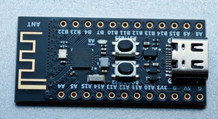

# Measure BLE transfer speed

## Software

- MRS Toolchain (from MounRiver Studio_Community):
  - RISC-V_Embedded_GCC12 12.2 - compiler
- wchisp https://github.com/ch32-rs/wchisp - firmware uploader
- nrfConnect for Android - client

## Hardware

- ch582f board
  - LED - A3
  - UART0_TX - B7

## Characteristics:

- char1 - result in txt: speed, time
- char2 - req: set size of single answer and total volume in bytes. E.g. `EE 01`
- char3 - Notification answer: data from MCU

## Result

Total speed about 0.8MBit/s (PHY 2) [pckt=238, 1MB, high priority] for distance =< 3 meters. If the distance more, the speed is decreased.

Power consumption about 14 uW*h (HAL_SLEEP, DCDC)
